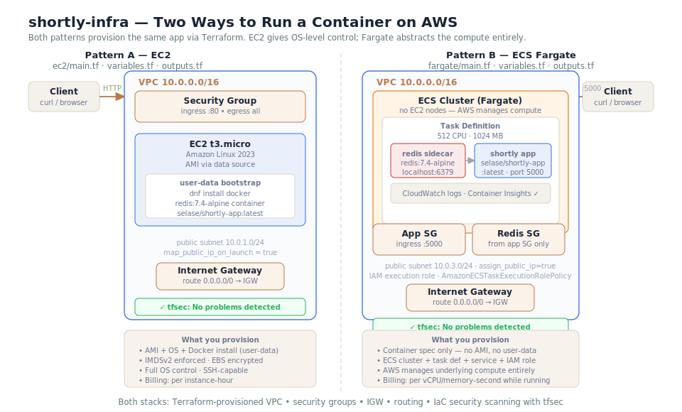

# shortly-infra


Terraform-provisioned AWS infrastructure for the **shortly** URL shortener —
**Project C** of a three-part DevOps portfolio series. This repository
demonstrates two different ways to run the same containerised application on
AWS, both provisioned as code, with IaC security scanning.

> **Portfolio series:**
> **A — [shortly-app](https://github.com/Selase17/shortly-app):** Flask service, containerised, with full CI/CD and a published Docker image.
> **B — [shortly-k8s](https://github.com/Selase17/shortly-k8s):** Kubernetes deployment — raw manifests, Helm chart, Prometheus/Grafana observability.
> **C — `shortly-infra`** (this repo): AWS infrastructure as code — EC2 and ECS Fargate, with IaC security scanning.

---

## What this is

Project A proved the app can be built, tested, and published. Project B proved
it can run on Kubernetes with observability. This project provisions the
*underlying cloud infrastructure* — VPC networking, compute, security groups —
entirely as code. Terraform describes the desired state; AWS is reconciled to
match.

Two patterns are implemented side by side, so the trade-offs are visible:

| | Pattern A — EC2 | Pattern B — ECS Fargate |
|---|---|---|
| **Location** | `ec2/` | `fargate/` |
| **Compute** | `t3.micro` virtual machine | Serverless — AWS manages it |
| **Bootstrap** | user-data shell script | None — container spec only |
| **OS access** | Full (SSH-capable) | None by design |
| **Image pull** | Docker CLI on the instance | ECS agent (via IAM role) |
| **Logs** | On the instance | CloudWatch automatically |
| **Billing** | Per instance-hour | Per vCPU/memory-second |
| **When to use** | Need OS control, custom tooling | Just run a container, less ops |

---

## Architecture



Both stacks provision a VPC (`10.0.0.0/16`) with a public subnet, an internet
gateway, and a route table. The compute layer differs: EC2 bootstraps Docker
via user-data and runs the app and Redis as containers on a single VM; Fargate
runs them as sidecar containers in a task definition, with AWS managing all
underlying compute. Both expose the app on a public IP and use security groups
to restrict traffic — ingress on the app port only, Redis accessible from the
app security group only.

---

## Repository layout

```
ec2/
  main.tf          VPC + security group + EC2 instance with user-data bootstrap
  variables.tf     region, instance type, app image, CIDRs
  outputs.tf       public IP, app URL, healthz URL

fargate/
  main.tf          VPC + security groups + ECS cluster + task definition + service
  variables.tf     region, app image, CIDRs, ports
  outputs.tf       cluster name, service name, IP lookup command
```

Each subfolder is an **independent Terraform root** — `terraform init/plan/apply`
runs inside each folder and maintains its own state. They are independent stacks
that can be deployed and destroyed separately.

---

## Prerequisites

- Terraform ≥ 1.5
- AWS CLI configured with appropriate credentials
- An IAM user/role with EC2, ECS, IAM, CloudWatch permissions

```bash
aws sts get-caller-identity    # confirm you are who you expect to be
```

---

## Usage

### Pattern A — EC2

```bash
cd ec2/
terraform init
terraform plan
terraform apply      # creates VPC, SG, EC2 instance

# Get the public IP and test
IP=$(terraform output -raw public_ip)
curl http://$IP/healthz

# Shorten a URL
curl -X POST http://$IP/shorten \
  -H "Content-Type: application/json" \
  -d '{"url":"https://example.com"}'

# Always tear down after use
terraform destroy
```

### Pattern B — ECS Fargate

```bash
cd fargate/
terraform init
terraform plan
terraform apply      # creates VPC, SGs, ECS cluster, task, service

# Get the task's public IP (assigned at runtime, not known to Terraform)
TASK_ARN=$(aws ecs list-tasks \
  --cluster shortly-infra-cluster \
  --service-name shortly-infra-app \
  --query "taskArns[0]" --output text)

aws ecs describe-tasks \
  --cluster shortly-infra-cluster \
  --tasks $TASK_ARN \
  --query "tasks[0].attachments[0].details[?name=='networkInterfaceId'].value" \
  --output text | xargs -I {} aws ec2 describe-network-interfaces \
  --network-interface-ids {} \
  --query "NetworkInterfaces[0].Association.PublicIp" --output text

# Wait ~2 minutes for the task to start, then test
curl http://<IP>:5000/healthz

# Stream live logs
aws logs tail /ecs/shortly-infra/app --follow

# Always tear down after use
terraform destroy
```

---

## IaC security scanning

Both stacks are scanned with [tfsec](https://github.com/aquasecurity/tfsec)
on every change. To run locally:

```bash
# Install
curl -s https://raw.githubusercontent.com/aquasecurity/tfsec/master/scripts/install_linux.sh | bash

# Scan
tfsec ec2/
tfsec fargate/
# → No problems detected
```

### Findings and decisions

| Finding | Severity | Decision | Reasoning |
|---|---|---|---|
| Public ingress `0.0.0.0/0` | CRITICAL | **Accepted** | Public web app — internet ingress is intentional |
| Public egress `0.0.0.0/0` | CRITICAL | **Accepted** | Instance/task needs internet access for Docker image pulls |
| Public IP subnet | HIGH | **Accepted** | No NAT Gateway — cost trade-off for a demo |
| VPC Flow Logs disabled | MEDIUM | **Accepted** | Production enhancement; out of scope for demo |
| CloudWatch CMK encryption | LOW | **Accepted** | AWS-managed encryption sufficient for 1-day retention |
| IMDSv2 not enforced | HIGH | **Fixed** | SSRF protection — `http_tokens = required` added |
| EBS root volume unencrypted | HIGH | **Fixed** | `encrypted = true` added to root block device |
| Container Insights disabled | LOW | **Fixed** | `containerInsights = enabled` added to ECS cluster |

Accepted findings are documented inline with `#tfsec:ignore:` comments explaining the reasoning.

---

## What I learned

- **Terraform state is the source of truth.** Terraform tracks what it created
  in a state file. On every `plan`, it compares desired state (`.tf` files)
  against real infrastructure, and shows exactly what will change. This makes
  IaC genuinely different from a script that creates the same resource every
  time it runs.

- **Data sources read without creating.** `data "aws_ami"` and
  `data "aws_availability_zones"` fetch existing AWS information at plan time —
  no AMI ID to hardcode, no AZ to guess. The config becomes region-portable.

- **The EC2/Fargate trade-off is about where the ops burden sits.** EC2 gives
  you control (OS, file system, SSH) but you manage the bootstrapping. Fargate
  removes the OS layer entirely — you describe the container and AWS runs it.
  Neither is universally better; the choice depends on what the workload needs.

- **IaC scanning is about deliberate decisions, not zero findings.** A clean
  scanner output with documented ignores is more trustworthy than a suppressed
  scan. Fixing real risks (IMDSv2, EBS encryption) and accepting intentional
  trade-offs (public web app ingress) with documented reasoning is the mature
  response.

- **Terraform destroy discipline matters.** EC2 and Fargate bill per hour/second
  while running. Building the habit of tearing down resources after every session
  — even when the cost is small — prevents the "forgotten instance" surprises
  that erode cloud budgets.

---

## Production considerations

This runs on minimal infrastructure for learning. For production use:

- [ ] Private subnets with a NAT Gateway for compute (removes direct public IP)
- [ ] Application Load Balancer in front of EC2/Fargate (enables HTTPS, health-based routing)
- [ ] HTTPS with ACM certificate (TLS termination at the ALB)
- [ ] Managed Redis (ElastiCache) rather than a sidecar container
- [ ] Remote Terraform state (S3 backend + DynamoDB lock table)
- [ ] VPC Flow Logs for network traffic visibility
- [ ] CloudWatch alarms and SNS notifications
- [ ] IAM roles scoped to least privilege (not AdministratorAccess)

---

## License

MIT — see [LICENSE](LICENSE).
